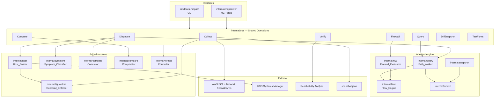

# Design Document

## Overview

`aws-netpath` is a single statically linked Go binary that collects AWS network configuration into a
Snapshot, then evaluates reachability and diagnoses failures against that Snapshot offline. It exposes
the same capabilities through a CLI and an MCP server over stdio, both calling one set of internal
operations.

The tool absorbs the existing `netprobe` codebase, which already implements the hard parts, and extends
it. Nothing in the engine is rewritten.

### What is inherited from netprobe

| Capability | Package | State |
| --- | --- | --- |
| Symbolic flow algebra | `internal/flow` | Built, tested |
| Network Firewall and Suricata evaluation with abstentions | `internal/nfw` | Built, tested |
| Provider-neutral model | `internal/model` | Built |
| Multi-profile AWS collection | `internal/collect`, `internal/collect/aws` | Built, tested |
| Snapshot format | `internal/snapshot` | Built |
| Route, NACL, security group, inspection walk | `internal/query` | Built, tested |
| Reachability Analyzer cross-check | `internal/verify` | Built, tested |
| Multi-account config | `internal/config` | Built, tested |
| CLI command surface | `internal/cli` | Built |

### What is added

| Capability | New package | Why it cannot come from a cloud API |
| --- | --- | --- |
| Host firewall and listener probing | `internal/host` | `firewalld` rules and listening sockets are invisible to AWS APIs |
| Symptom classification | `internal/symptom` | Pure logic translating a client error into a search direction |
| Verdict correlation across cloud and host | `internal/correlate` | Combines findings the engine and prober produce separately |
| Baseline path comparison | `internal/compare` | Diffs a failing path against a working one |
| Return path asymmetry detection | `internal/query` (extension) | Requires a second, independent evaluation |
| MCP server | `internal/mcpserver` | Agent surface over the same operations |
| Guardrails | `internal/guardrail` | Read-only enforcement in code for the new host surface |
| Snapshot diff | `internal/diffsnap` | Ties a breakage to a change |
| Declared flow tests | `internal/flowtest` | CI assertion of expected reachability |

### Why Go, and why absorb rather than wrap

The original plan was a Python orchestrator invoking `netprobe` as a subprocess. Absorbing is better
here for concrete reasons:

- The engine is the hard part and it already exists, tested, in Go. A Python rewrite would discard it.
- One binary with no runtime dependency can be copied to a jump host, which is exactly where network
  troubleshooting happens.
- A process boundary between orchestrator and engine would mean two release artefacts and eventual
  version skew, for no benefit once both are ours.
- MCP has an [official Go SDK](https://github.com/modelcontextprotocol/go-sdk) with stdio transport,
  so the agent surface does not require Python.

The cost is divergence from the Python house style of `kiro-aws-cost-analytics` and
`kiro-aws-firewall-analytics`. The spec patterns carry over regardless: shared operations behind both
interfaces, an explicit guardrail allowlist, low-token markdown output, and requirement traceability.

## Architecture



`internal/ops` is new and exists so the CLI and the MCP server share one implementation. The existing
`internal/cli` command bodies move into `ops`, leaving `cli` as flag parsing and exit-code mapping.

## Command and tool surface

| Command / tool | Purpose | Requires |
| --- | --- | --- |
| `collect` | Ingest AWS configuration into a Snapshot | AWS credentials |
| `query` | Reachability verdict for a Flow | Snapshot |
| `firewall` | Firewall-only verdict with rule citations | Snapshot |
| `diagnose` | Full pipeline: cloud Layers, return path, host Layers, correlation | Snapshot, SSM for host |
| `compare` | Diff a failing path against a reference path | Snapshot |
| `verify` | Cross-check engine verdict against Reachability Analyzer | Snapshot, AWS credentials |
| `diff` | Compare two Snapshots | Two Snapshots |
| `test` | Assert declared Flows in CI | Snapshot, declared flow file |

Every command is also an MCP tool with the same name and parameters.

## Diagnose request flow

`diagnose` is the primary addition. Each stage records a `Layer_Verdict`, and no stage may downgrade an
`ABSTAIN` to a `PASS`.

1. **Config** — load configuration, locate the Snapshot, validate schema version.
2. **Classify** — map the Symptom, if given, to candidate Layers and a check order. Pure logic.
3. **Resolve** — resolve both endpoints from the Snapshot; halt on ambiguity.
4. **Cloud layers** — walk routes, NACLs, security groups, and firewall policy for the forward Flow.
5. **Return path** — evaluate the reverse Flow, compare next hops, detect asymmetry.
6. **Host layers** — if the destination is SSM-managed, probe listener and firewall allowlist.
7. **Correlate** — apply verdict precedence, reconcile against the Symptom, record contradictions.
8. **Format** — blocking Layer with Citations, cleared Layers, Abstentions with reasons.

Stage 6 runs even when stage 4 reports the traffic permitted. That ordering is the point: a clean cloud
verdict is where host investigation begins, not where the run ends.

## Components and interfaces

### internal/model — verdict types (extension)

```go
type LayerVerdict string

const (
    VerdictPass    LayerVerdict = "pass"
    VerdictBlocked LayerVerdict = "blocked"
    VerdictAbstain LayerVerdict = "abstain"
)

type Layer string

const (
    LayerResolution    Layer = "resolution"
    LayerRoute         Layer = "route"
    LayerNACL          Layer = "nacl"
    LayerSecurityGroup Layer = "security_group"
    LayerFirewall      Layer = "firewall"
    LayerReturnPath    Layer = "return_path"
    LayerHostFirewall  Layer = "host_firewall"
    LayerHostListener  Layer = "host_listener"
)

// Citation is the evidence behind a decision.
type Citation struct {
    Kind       string // "route" | "nacl" | "security_group" | "nfw_rule" | "command"
    Identifier string // rtb-…, sg-…, nfr-allow-east-west sid 3 (priority 6)
    Detail     string
}

type LayerResult struct {
    Layer     Layer
    Verdict   LayerVerdict
    Citations []Citation
    Reason    string // required when Verdict == VerdictAbstain
}

type Verdict struct {
    PrimaryBlocker    *Layer
    AdditionalBlocked []Layer
    Results           []LayerResult
    Contradictions    []string
    Authoritative     bool // false when any Abstention affects the conclusion
}
```

Making `ABSTAIN` a distinct verdict rather than a missing value is what stops "could not check" from
rendering as "checked and fine". `Authoritative` carries that fact to the top level, matching the
existing abstention behaviour in `internal/nfw`.

### internal/symptom — Symptom_Classifier

Pure function, no I/O, no Snapshot. Implements the requirement 9.1 table.

The distinction that carries the diagnostic weight is **silent discard versus active rejection**:

- silent discard (`timeout`) means a policy dropped the packet without replying: security group, NACL,
  or missing route
- active rejection (`no-route-to-host`, ICMP administratively prohibited) means a device chose to
  reject, in practice a host firewall
- `connection-refused` means a RST returned, so the host is reachable and either nothing listens or the
  host rejected

For actively rejected symptoms the classifier orders host Layers first, inverting the default flow
order and reaching the answer in one probe instead of five.

### internal/host — Host_Prober

Read-only probes via SSM `SendCommand`, using fixed templates with validated substitution.

| Check | Command | Interpretation |
| --- | --- | --- |
| listener | `ss -tlnp` | absent listener explains `connection-refused` |
| firewalld rich rules | `firewall-cmd --zone=<zone> --list-rich-rules` | source absent explains `no-route-to-host` |
| firewalld services | `firewall-cmd --zone=<zone> --list-services` | a named service may allow the port |
| local route | `ip route get <dst>` | unexpected egress interface |
| path MTU | `ping -M do -s <size> -c 2 <dst>` | large-packet failure explains a payload stall |

Allowlist matching is by network containment, not string equality: an entry of `198.51.100.128/26` must
be recognised as covering a source inside it. This is a real failure mode — a host provisioned from an
older template carried a narrower allowlist than the current one, and string comparison would have
missed that the current entry should have covered the source.

When SSM is unavailable, host Layers abstain. "Cloud clear, host unverified" is a materially different
answer from "all clear", and the report keeps them distinct.

### internal/correlate — Correlator

Applies verdict precedence (earliest blocking Layer in flow order is primary), reconciles findings
against the Symptom, and records contradictions instead of resolving them silently. A contradiction
such as "symptom was `connection-refused` but every Layer passed" is itself diagnostic. Sets
`Authoritative = false` when an Abstention could change the conclusion.

### internal/guardrail — Guardrail_Enforcer

```go
var allowedAWSActions = map[string]bool{
    "DescribeInstances": true, "DescribeNetworkInterfaces": true,
    "DescribeSubnets": true, "DescribeVpcs": true, "DescribeRouteTables": true,
    "DescribeNetworkAcls": true, "DescribeSecurityGroups": true,
    "DescribeTransitGateways": true, "DescribeTransitGatewayRouteTables": true,
    "SearchTransitGatewayRoutes": true, "DescribeTransitGatewayAttachments": true,
    "DescribeFirewall": true, "DescribeFirewallPolicy": true, "DescribeRuleGroup": true,
    "GetCallerIdentity": true,
    "SendCommand": true, "GetCommandInvocation": true, "DescribeInstanceInformation": true,
    "CreateNetworkInsightsPath": true, "StartNetworkInsightsAnalysis": true,
    "DescribeNetworkInsightsAnalyses": true,
}

var allowedHostCommands = map[string]bool{
    "ss": true, "firewall-cmd": true, "ip": true, "ping": true,
}
```

`SendCommand` is inherently capable of mutation, so the **host command allowlist is the real control**,
checked before dispatch, not the API allowlist. Commands are invoked as argument lists, never shell
strings, and arguments containing shell metacharacters are rejected.

Reachability Analyzer path and analysis creation are the only non-`Describe` AWS calls. They create
analysis objects, not infrastructure, and only run under `verify`.

### internal/format — Formatter

Text by default (the existing `netprobe` output style, which already names rules and priorities), with
JSON and markdown modes. Three fixed sections: blocking Layer with Citations, cleared Layers,
Abstentions with reasons. Row truncation beyond a configured limit, with the truncation stated, to keep
agent consumption cheap.

### internal/mcpserver — MCP surface

Uses the official Go SDK over stdio. Each command in `internal/ops` is registered as a tool with a
schema. Tool results return the markdown renderer output so agent consumption stays low-token, with
JSON available for structured use.

## Migration plan

The absorption is mechanical and should land before new capability:

1. Initialise git in the new repo and import the `netprobe` tree.
2. Change the module path from `github.com/netprobe/netprobe` to `github.com/jajera/aws-netpath`.
3. Rename `cmd/netprobe` to `cmd/aws-netpath`.
4. Promote `go.mod` requirements from `// indirect` to direct where genuinely used.
5. Extract command bodies from `internal/cli` into `internal/ops`, leaving `cli` as flags plus exit
   codes.
6. Confirm `go test ./...` passes unchanged before adding anything.

Step 6 is the gate. New work starts only from a green inherited test suite.

## Technology choices

- **Go 1.26** with `aws-sdk-go-v2`, matching the inherited code.
- **Official MCP Go SDK** for the stdio server.
- **Standard library testing** with table-driven tests, as the inherited packages already use. No new
  assertion framework.
- **Engine packages stay SDK-free.** `internal/flow`, `internal/nfw`, and `internal/model` must remain
  dependency-free so evaluation stays testable with no account and no network.

## Error handling

| Condition | Behaviour |
| --- | --- |
| Missing profile for an account | Name the required profile; record a collection error; continue |
| Partial collection failure | Record in `collection_errors`; exit `1`; Snapshot remains usable |
| Unsupported Snapshot schema version | Error stating expected and found versions |
| Ambiguous endpoint | List candidates; halt; exit `2` |
| Destination outside Snapshot | Evaluate routing only; abstain on destination-side policy |
| Unmodelled firewall construct | Abstain naming the construct; verdict non-authoritative |
| Rule group missing from Snapshot | Abstain rather than assume |
| SSM unavailable or instance unmanaged | Abstain on host Layers |
| Command timeout | Abstain for that check; continue others |
| Engine and Reachability Analyzer disagree | Report both prominently; prefer neither |

The invariant across every row: an unverified Layer is never converted into an implied pass.

## Testing strategy

- **Inherited suites run unchanged.** Flow algebra, firewall evaluation, query regression, and verify
  comparison tests are the regression baseline for the migration.
- **Table-driven tests** for the Symptom_Classifier: every Symptom yields at least one candidate Layer,
  and active-rejection Symptoms always order host Layers first.
- **Correlator tests**: verdict precedence selects the earliest blocking Layer; an Abstention affecting
  the conclusion never yields an authoritative verdict; `ABSTAIN` is never aggregated as `PASS`.
- **Guardrail tests**: allowlists are exact-match; metacharacter arguments always rejected.
- **Host parser fixtures**: an allowlist covering the source by containment; one omitting it; an absent
  listener.
- **End-to-end regression reproducing the motivating incident**: all cloud Layers `PASS`, `firewalld`
  allowlist missing the source CIDR, expected verdict `HOST_FIREWALL` blocked with the allowlist cited.
- **Asymmetry regression**: forward and return resolving to different next hops with a
  `connect-then-stall` Symptom, expected `RETURN_PATH` reported with both next hops cited.

## Known limitations carried forward

Documented rather than hidden, consistent with the abstention stance:

- Destinations outside the Snapshot are evaluated on routing alone; destination-side policy abstains.
- The gateway subnet to firewall endpoint hop inside inspection VPCs is not modelled separately;
  firewall evaluation occurs at VPC entry.
- Domain allowlists, raw Suricata rules, rule options, and `DEFAULT_ACTION_ORDER` policies abstain.
- Transit gateway policy tables and Connect attachments are not modelled.
- IPv4 only.

## Prior art

[Batfish](https://github.com/batfish/batfish) pioneered configuration-based network verification and
remains excellent, particularly for physical network configuration. `aws-netpath` differs in being a
single dependency-free binary, ingesting live multi-account cloud APIs rather than config files,
modelling managed cloud firewalls, cross-checking its own answers against the provider's analyzer, and
probing host state that no configuration model can see.

AWS Reachability Analyzer answers one 5-tuple at a time, per-query billed, within a single region, and
does not model domain lists or raw Suricata rules. `aws-netpath` uses it as a correctness check on its
own model rather than as its engine.
